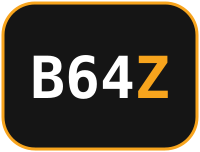
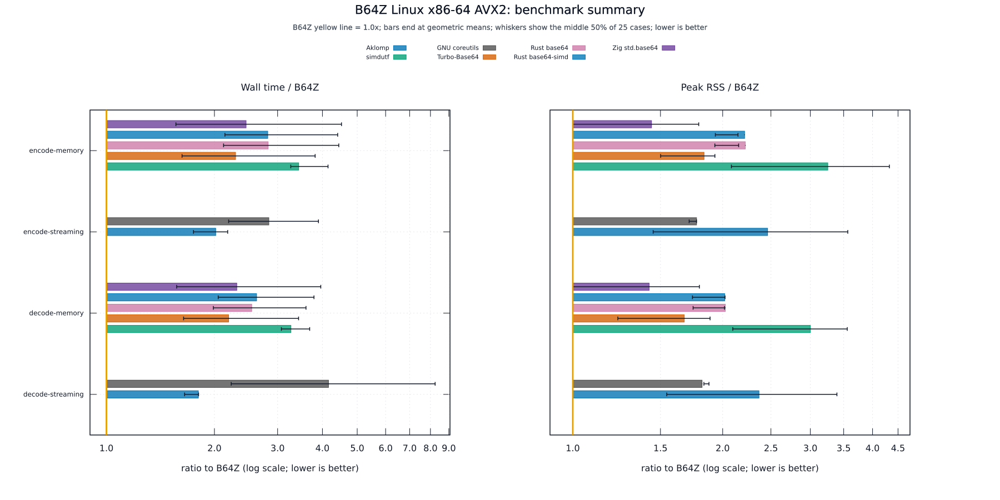

<!-- markdownlint-disable MD033 MD041 -->

<p align="center">
  
</p>

<p align="center">
  <strong>Strict Base64 for Zig, with bounded-memory file conversion.</strong>
</p>

<p align="center">
  <a href="wiki/Getting-Started.md"></a>
  <a href="CHANGELOG.md"></a>
  <a href="https://github.com/eneskemalergin/b64z/actions/workflows/ci.yml"></a>
  <a href="#where-it-stands"></a>
  <a href="LICENSE"></a>
</p>

<p align="center">
  <a href="wiki/Home.md"></a>
  <a href="wiki/API.md"></a>
  <a href="wiki/Benchmarking.md"></a>
</p>

---

I built B64Z for Base64 work where memory use matters alongside speed. It is a library and a command-line converter:

- The library encodes and decodes buffers you supply, without allocating. Use separate input and output buffers, convert in place, or feed chunks through an `Encoder` or `Decoder`.
- The command converts a whole file in one buffer or streams it through fixed buffers. Streaming memory does not grow with file length.

B64Z uses standard padded RFC 4648 Base64. Decode rejects whitespace, URL-safe characters, malformed padding, and non-zero unused bits. There is no forgiving decode mode.

<p align="center">
  <a href="bench/linux-x86-avx2/README.md">
    <picture>
      <source media="(prefers-color-scheme: dark)" srcset="bench/linux-x86-avx2/figures/summary-dark.svg">
      <source media="(prefers-color-scheme: light)" srcset="bench/linux-x86-avx2/figures/summary-light.svg">
      
    </picture>
  </a>
</p>
<p align="center"><sub>File-conversion time and peak process memory on one Linux x86-64 host. Markers show geometric means; whiskers show the middle 50% of input cases. B64Z is the 1.0x reference; lower is better. Open the report for absolute values and run conditions.</sub></p>

## Where it stands

B64Z is in active development. AVX2 acceleration is available on x86-64; other builds select the scalar codec. Backend selection happens at compile time, so an AVX2 binary does not fall back on an older CPU. The current tests and benchmark reports cover Linux x86-64, not every system the scalar code might compile for.

The benchmarks time complete commands, including startup, file reads, allocation, and output. They do not rank the libraries' inner loops. The [AVX2 report](bench/linux-x86-avx2/README.md), [scalar report](bench/linux-x86-scalar/README.md), and [measurement method](wiki/Benchmarking.md) keep those comparisons explicit.

## Start

Build from the repository root with Zig 0.16.0:

```sh
zig build -Dcpu=native -Doptimize=ReleaseFast -Dstrip=true
./zig-out/bin/custom-base64 --mode encode-streaming input.bin > encoded.b64
./zig-out/bin/custom-base64 --mode decode-streaming encoded.b64 > decoded.bin
```

Use different input and output paths. This build targets the current CPU. The [getting-started guide](wiki/Getting-Started.md) covers scalar builds, a round-trip example, and tests.

## Documentation

The [wiki](wiki/Home.md) contains the guides and reference:

[Command line](wiki/Command-Line.md) | [Library examples](wiki/Library-Guide.md) | [API reference](wiki/API.md) | [Benchmark method](wiki/Benchmarking.md) | [Benchmark tools](wiki/Benchmark-Tools.md) | [Development](wiki/Development.md)

## License

MIT. See [LICENSE](LICENSE).

The AVX2 kernels include code adapted from Aklomp Base64 under BSD-2-Clause; see [third-party notices](THIRD_PARTY_NOTICES.md).

---

<p align="center"><em>Narrow channel flows;<br>
three expand to four, return,<br>
not one droplet lost.</em></p>
