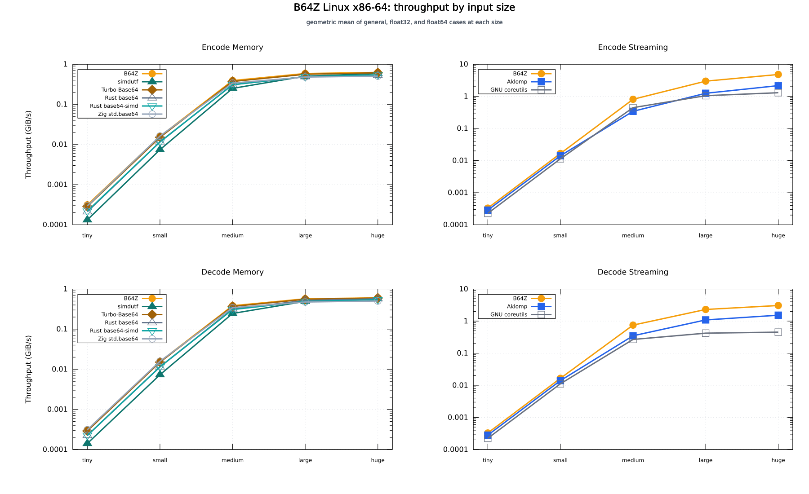
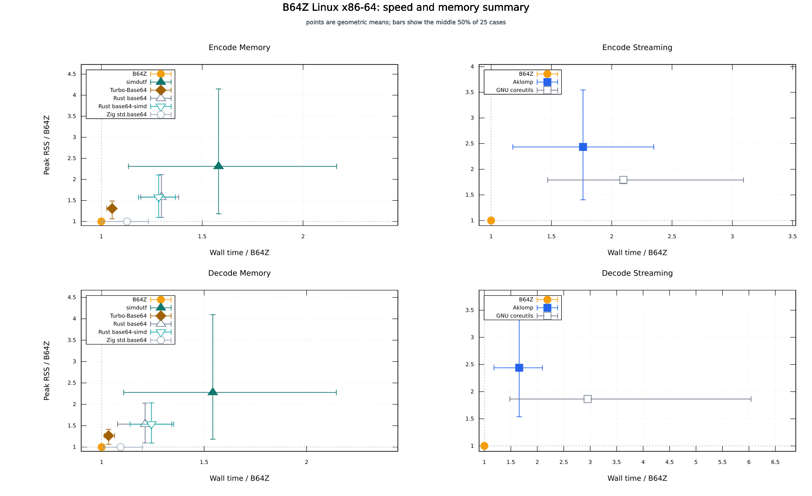

# B64Z benchmark: linux-x86-avx2

Generated: `2026-09-19T21:46:55Z`

B64Z: `custom-base64 0.1.0 backend=avx2 optimize=ReleaseFast target=x86_64`

## Result

B64Z is the 1.0x reference in each mode. Time and RSS ratios use the geometric mean of 25 input cases. Values above 1.0x mean that the tool took more time or used more RSS than B64Z.

The memory and streaming rows stay separate. A peer appears only in the mode that its selected executable actually runs.

| Mode | Tool | Time / B64Z | RSS / B64Z | Faster than B64Z | Lower RSS than B64Z | Huge time (ms) | Huge RSS (MiB) |
| --- | --- | ---: | ---: | ---: | ---: | ---: | ---: |
| `encode-memory` | B64Z | 1.000x | 1.000x | - | - | 50.640 | 74.74 |
| `encode-memory` | simdutf | 1.578x | 2.309x | 0 | 0 | 52.263 | 78.07 |
| `encode-memory` | Turbo-Base64 | 1.054x | 1.311x | 1 | 0 | 51.279 | 75.85 |
| `encode-memory` | Rust base64 | 1.300x | 1.581x | 0 | 0 | 58.512 | 76.39 |
| `encode-memory` | Rust base64-simd | 1.286x | 1.576x | 0 | 0 | 59.074 | 76.49 |
| `encode-memory` | Zig std.base64 | 1.113x | 0.999x | 6 | 3 | 62.039 | 74.74 |
| `encode-streaming` | B64Z | 1.000x | 1.000x | - | - | 6.090 | 0.92 |
| `encode-streaming` | Aklomp | 1.775x | 2.433x | 0 | 0 | 13.332 | 3.68 |
| `encode-streaming` | GNU coreutils | 2.120x | 1.778x | 0 | 0 | 23.635 | 1.82 |
| `decode-memory` | B64Z | 1.000x | 1.000x | - | - | 53.790 | 74.74 |
| `decode-memory` | simdutf | 1.550x | 2.277x | 0 | 0 | 55.400 | 78.15 |
| `decode-memory` | Turbo-Base64 | 1.046x | 1.268x | 1 | 0 | 53.879 | 75.90 |
| `decode-memory` | Rust base64 | 1.215x | 1.532x | 0 | 0 | 56.000 | 76.47 |
| `decode-memory` | Rust base64-simd | 1.252x | 1.538x | 0 | 0 | 58.996 | 76.47 |
| `decode-memory` | Zig std.base64 | 1.097x | 0.999x | 4 | 7 | 63.762 | 74.74 |
| `decode-streaming` | B64Z | 1.000x | 1.000x | - | - | 8.920 | 0.91 |
| `decode-streaming` | Aklomp | 1.716x | 2.440x | 0 | 0 | 19.207 | 3.11 |
| `decode-streaming` | GNU coreutils | 3.058x | 1.868x | 0 | 0 | 68.244 | 1.66 |

`Faster than B64Z` and `Lower RSS than B64Z` count cases where the peer is strictly below the B64Z value. They are not a combined score.

## Figures

The throughput figure averages the five data forms at each size: general bytes, float32 raw, float32 zlib, float64 raw, and float64 zlib. The isocost figure summarizes all 25 cases and shows the middle 50% of per-case ratios as bars.

PNG copies are in [`figures/`](figures/) for local use.

## What was measured

Each command reads one file and writes Base64 or decoded bytes to stdout. Zebrac discards child stdout, so output comparison is separate from the timed command. Process startup, file reads, allocation, encoding or decoding, and stdout writes are included in the measured process.

Zebrac ran `20` measured samples after `5` warmups, with a `15000 ms` duration ceiling and an exact maximum sample count. Every recorded command has zero failed samples.

B64Z uses chunk `65536` for both memory command lines and chunks `8191` and `4093` for the two streaming command lines. The memory command passes the chunk flag for a stable command record; its whole-file path does not use the streaming buffer.

Correctness checks passed for B64Z and every selected peer. The run checks valid fixtures, invalid B64Z error cases, and all 25 benchmark inputs before timing.

The byte checks compare B64Z and every selected peer against the canonical padded bytes produced by Aklomp.

The largest B64Z A/A mean-time gap on the huge general input was `1.33%` across the four modes.

## Data

The benchmark contains 25 byte inputs: 5 general inputs, 10 float32 mzML payload inputs, and 10 float64 mzML payload inputs. Each family has tiny, small, medium, large, and huge sizes at 256 B, 16 KiB, 1 MiB, 8 MiB, and 32 MiB. The zlib files are compressed payload bytes, not XML documents.

Decode rows read generated canonical Base64 files under `bench/work/inputs/encoded/`. Their size and modification time are checked before reuse. No digest list or per-input manifest is used.

## Tools and versions

| Tool | Selected modes | Version or build | Executable |
| --- | --- | --- | --- |
| B64Z | all four | `custom-base64 0.1.0 backend=avx2 optimize=ReleaseFast target=x86_64`; `zig -Dcpu=haswell -Doptimize=ReleaseFast -Dstrip=true` | `bench/linux-x86-avx2/bin/custom-base64` |
| Aklomp | encode-streaming, decode-streaming | `aklomp/base64 bf058e571ac5002b75b03fed38e33ed4e8d45eff, upstream make` | `tools/bin/aklomp-base64` |
| simdutf | encode-memory, decode-memory | `simdutf v9.2.0 8abc1d7a466bc882c2d72e1effd8661492db257c, Release CMake and direct C++ adapter` | `tools/bin/simdutf-fastbase64` |
| GNU coreutils | encode-streaming, decode-streaming | `GNU coreutils base64 9.11, local build flags -g -O2` | `tools/bin/coreutils-base64` |
| Turbo-Base64 | encode-memory, decode-memory | `Turbo-Base64 d9e584363280055ba6355938a48dc3711183f50f, upstream make and direct C adapter` | `tools/bin/turbo-base64` |
| Rust base64 | encode-memory, decode-memory | `Rust base64 crate 0.23.1, Simd engine, Cargo release fat LTO` | `tools/bin/rust-base64-simd` |
| Rust base64-simd | encode-memory, decode-memory | `Rust base64-simd crate 0.8.0, Cargo release fat LTO` | `tools/bin/rust-base64-simd-crate` |
| Zig std.base64 | encode-memory, decode-memory | `Zig 0.16.0 std.base64, ReleaseFast -Dcpu=native adapter` | `tools/bin/zig-std-base64` |

The Aklomp and GNU Coreutils command rows are streaming rows because those selected executables expose file-processing commands, not the memory adapters used by the other peers. The Rust, simdutf, Turbo-Base64, and Zig rows use the local direct file adapters listed in `tools/tool.md`.

## Reading the result

- `encode-memory`: B64Z has the lowest geometric-mean time among the listed rows. Lower geometric-mean RSS: Zig std.base64.
- `encode-streaming`: B64Z has the lowest geometric-mean time among the listed rows. No listed peer has lower geometric-mean RSS.
- `decode-memory`: B64Z has the lowest geometric-mean time among the listed rows. Lower geometric-mean RSS: Zig std.base64.
- `decode-streaming`: B64Z has the lowest geometric-mean time among the listed rows. No listed peer has lower geometric-mean RSS.

## Run conditions

- Host: `AMD Ryzen 9 3950X 16-Core Processor`, `x86_64`, `32 logical CPUs`.
- Kernel: `7.2.5-200.fc44.x86_64`; CPU governor: `schedutil`.
- Git commit: `4c20443`; tracked changes at measurement time: `yes`.
- Runner: `zebrac 0.6.2`; gnuplot: `gnuplot 6.0.3 patchlevel 3`; Zig: `0.16.0`.
- The file cache is warm after verification. The runner does not pin processes to a CPU or flush the page cache.
- These numbers describe the named local binaries on this host. They do not describe a peer library without its command adapter or a different compiler build.

## Files

- [`measurements.tsv`](measurements.tsv) contains one row for every measured command and input, including sample quartiles and the exact command string.
- [`summary.tsv`](summary.tsv) contains the values used by the tables and figures.
- `bench/work/` contains ignored encoded inputs and raw Zebrac JSON for rerendering during local work.

The report does not produce one report per input. The table and the two figures cover the complete 100 groups without turning each input into a separate publication page.
