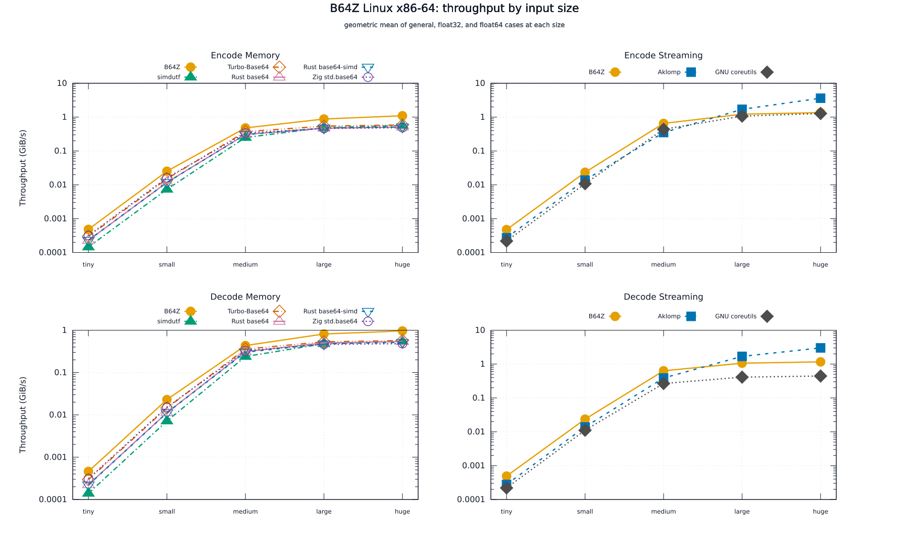
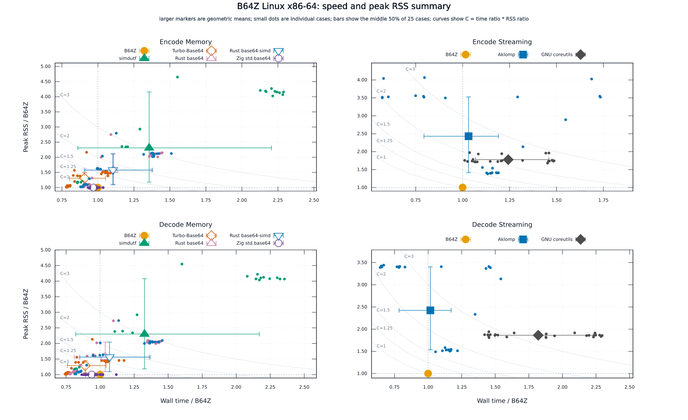

# B64Z benchmark: linux-x86-scalar

Generated: `2026-09-23T18:57:49Z`

B64Z: `custom-base64 0.1.0 backend=scalar optimize=ReleaseFast target=x86_64`

## Terms

For B64Z, `memory` means the command reads the complete input into one buffer and converts it in place. `Streaming` means the command uses fixed input and output buffers. The benchmark method and input details are in the [benchmark README](../README.md).

`Peak RSS` is the per-sample maximum resident set size reported by Zebrac for the timed process. The table and ratios use the mean of those per-sample peaks. It includes the executable, runtime, file I/O buffers, codec state, and resident input or output allocations; it is not the size of one buffer. `RSS / B64Z` compares that process value with B64Z in the same mode and input case.

The size names refer to the raw case bytes: `tiny` = 256 B, `small` = 16 KiB, `medium` = 1 MiB, `large` = 8 MiB, and `huge` = 32 MiB. Decode modes read the corresponding padded Base64 file, which is larger than the raw case.

## Result

B64Z is the 1.0x reference in each mode. Time and RSS ratios use the geometric mean of 25 input cases. Values above 1.0x mean that the tool took more time or used more RSS than B64Z.

The full-input memory and streaming rows stay separate. A peer appears only in the mode that its selected executable actually runs.

| Mode               | Tool             | Time / B64Z | RSS / B64Z | Faster than B64Z | Lower RSS than B64Z | Huge time (ms) | Huge RSS (MiB) |
| ------------------ | ---------------- | ----------: | ---------: | ---------------: | ------------------: | -------------: | -------------: |
| `encode-memory`    | B64Z             |      1.000x |     1.000x |                - |                   - |         27.803 |          42.70 |
| `encode-memory`    | simdutf          |      2.380x |     3.286x |                0 |                   0 |         53.759 |          78.05 |
| `encode-memory`    | Turbo-Base64     |      1.602x |     1.860x |                0 |                   0 |         53.071 |          75.91 |
| `encode-memory`    | Rust base64      |      1.952x |     2.242x |                0 |                   0 |         61.404 |          76.35 |
| `encode-memory`    | Rust base64-simd |      1.947x |     2.237x |                0 |                   0 |         59.691 |          76.39 |
| `encode-memory`    | Zig std.base64   |      1.705x |     1.441x |                0 |                   0 |         63.801 |          74.92 |
| `encode-streaming` | B64Z             |      1.000x |     1.000x |                - |                   - |         22.639 |           0.92 |
| `encode-streaming` | Aklomp           |      1.082x |     2.464x |                9 |                   0 |          7.462 |           3.69 |
| `encode-streaming` | GNU coreutils    |      1.535x |     1.779x |                0 |                   0 |         23.289 |           1.79 |
| `decode-memory`    | B64Z             |      1.000x |     1.000x |                - |                   - |         32.142 |          42.59 |
| `decode-memory`    | simdutf          |      2.249x |     3.007x |                0 |                   0 |         56.116 |          78.11 |
| `decode-memory`    | Turbo-Base64     |      1.505x |     1.682x |                0 |                   0 |         54.310 |          75.86 |
| `decode-memory`    | Rust base64      |      1.763x |     2.031x |                0 |                   0 |         57.255 |          76.42 |
| `decode-memory`    | Rust base64-simd |      1.816x |     2.018x |                0 |                   0 |         59.637 |          76.44 |
| `decode-memory`    | Zig std.base64   |      1.599x |     1.425x |                0 |                  10 |         63.616 |          74.99 |
| `decode-streaming` | B64Z             |      1.000x |     1.000x |                - |                   - |         27.119 |           1.05 |
| `decode-streaming` | Aklomp           |      1.036x |     2.365x |                9 |                   0 |         10.460 |           3.13 |
| `decode-streaming` | GNU coreutils    |      2.382x |     1.810x |                0 |                   0 |         70.086 |           1.69 |

`Faster than B64Z` and `Lower RSS than B64Z` count cases where the peer is strictly below the B64Z value. They are not a combined score.

## Figures

The figures use the inputs and method described in the [benchmark README](../README.md).

  <picture>
    <source media="(prefers-color-scheme: dark)" srcset="figures/scaling-dark.svg">
    <source media="(prefers-color-scheme: light)" srcset="figures/scaling-light.svg">
    
  </picture>

  <picture>
    <source media="(prefers-color-scheme: dark)" srcset="figures/isocost-dark.svg">
    <source media="(prefers-color-scheme: light)" srcset="figures/isocost-light.svg">
    
  </picture>

## Measurement

Zebrac ran `20` measured samples after `5` warmups, with a `15000 ms` duration ceiling and an exact maximum sample count. Every recorded command has zero failed samples.

B64Z passes chunks `8191` and `4093` to the streaming command lines. Memory command lines do not pass `--chunk`.

Correctness checks passed for B64Z and every selected peer. The run checks valid fixtures, invalid B64Z error cases, and all 25 benchmark inputs before timing.

The byte checks compare B64Z and every selected peer against Aklomp's canonical padded bytes.

The largest B64Z A/A mean-time gap on the huge general input was `2.37%` across the four modes.

## Data

The case sizes, byte forms, and compression details are listed in the [benchmark README](../README.md).

## Tools and versions

- **B64Z** (all four modes): `custom-base64 0.1.0 backend=scalar optimize=ReleaseFast target=x86_64`; `zig -Dcpu=x86_64 -Doptimize=ReleaseFast -Dstrip=true`.
- **Aklomp** (encode-streaming, decode-streaming): `aklomp/base64 bf058e571ac5002b75b03fed38e33ed4e8d45eff, AVX2_CFLAGS=-mavx2 upstream make`.
- **simdutf** (encode-memory, decode-memory): `simdutf v9.2.0 8abc1d7a466bc882c2d72e1effd8661492db257c, Release CMake and direct C++ adapter`.
- **GNU coreutils** (encode-streaming, decode-streaming): `GNU coreutils base64 9.11, local build flags -g -O2`.
- **Turbo-Base64** (encode-memory, decode-memory): `Turbo-Base64 d9e584363280055ba6355938a48dc3711183f50f, upstream make and direct C adapter`.
- **Rust base64** (encode-memory, decode-memory): `Rust base64 crate 0.23.1, Simd engine, Cargo release fat LTO`.
- **Rust base64-simd** (encode-memory, decode-memory): `Rust base64-simd crate 0.8.0, Cargo release fat LTO`.
- **Zig std.base64** (encode-memory, decode-memory): `Zig 0.16.0 std.base64, ReleaseFast -Dcpu=native adapter`.

Peer commands and their mode coverage are described in [Local Peer Tools](../../tools/tool.md).

## Reading the result

- `encode-memory`: B64Z has the lowest geometric-mean time among the listed rows. No listed peer has lower geometric-mean RSS.
- `encode-streaming`: B64Z has the lowest geometric-mean time among the listed rows. No listed peer has lower geometric-mean RSS.
- `decode-memory`: B64Z has the lowest geometric-mean time among the listed rows. No listed peer has lower geometric-mean RSS.
- `decode-streaming`: B64Z has the lowest geometric-mean time among the listed rows. No listed peer has lower geometric-mean RSS.

## Run conditions

- Host: `AMD Ryzen 9 3950X 16-Core Processor`, `x86_64`, `32 logical CPUs`.
- Kernel: `7.2.5-200.fc44.x86_64`; CPU governor: `schedutil`.
- Git commit: `3309e5b8a7b27b359bc3fed8f6524ea0a7d6a79b`; project changes at measurement time: `no`.
- Runner: `zebrac 0.6.2`; gnuplot: `gnuplot 6.0.3 patchlevel 3`; Zig: `0.16.0`.
- Host tools: GCC `gcc (GCC) 16.2.1 20260819 (Red Hat 16.2.1-2)`; Clang `clang version 22.1.8 (Fedora 22.1.8-4.fc44)`; Rust `rustc 1.98.0 (88d9e12ae 2026-08-18)`; Cargo `cargo 1.98.0 (797e8a9bc 2026-08-05)`; CMake `cmake version 4.3.0`; Make `GNU Make 4.4.1`.
- The file cache is warm after verification. The runner does not pin processes to a CPU or flush the page cache.
- The target changes the B64Z build. Peer binaries keep their native build and runtime dispatch settings.

## Files

[`measurements.tsv`](measurements.tsv) contains the measured rows. [`summary.tsv`](summary.tsv) contains the values used by the table and figures.
