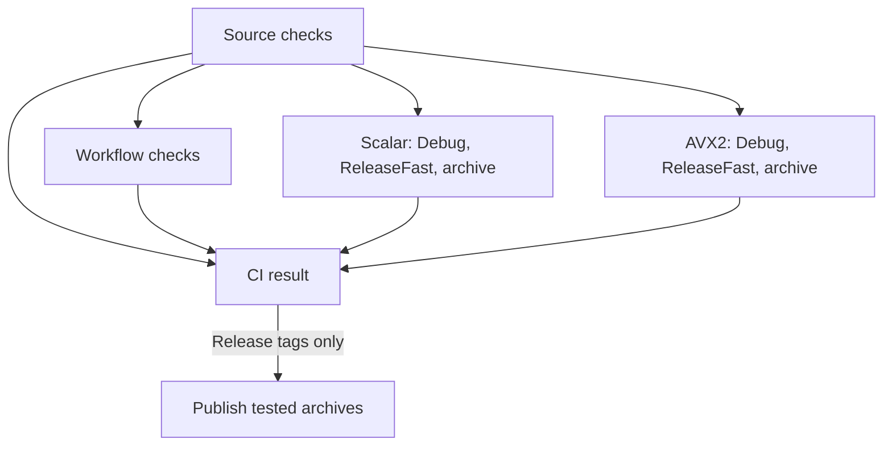

# Development

Run the tests, understand CI, and prepare a tagged B64Z release.

## Local checks

Use Zig 0.16.0. [Getting started](Getting-Started.md#run-the-tests) describes the suites and what they check. CI uses these exact Linux x86-64 targets:

```sh
zig fmt --check build.zig src tests tools/wrappers/zig_std_base64.zig
zig build test -Dtarget=x86_64-linux -Dcpu=x86_64 --summary all
zig build test -Dtarget=x86_64-linux -Dcpu=x86_64 -Doptimize=ReleaseFast -Dstrip=true --summary all
zig build test -Dtarget=x86_64-linux -Dcpu=haswell --summary all
zig build test -Dtarget=x86_64-linux -Dcpu=haswell -Doptimize=ReleaseFast -Dstrip=true --summary all
```

The `haswell` commands require a Haswell-compatible CPU with AVX2. The scalar tests skip the two private AVX2 tests; the AVX2 build runs them. No other operating system or architecture is part of this runtime matrix.

## CI jobs

[CI](https://github.com/eneskemalergin/b64z/blob/main/.github/workflows/ci.yml) runs on pull requests to `main`, pushes to `main`, merge-queue commits, and manual runs. The release workflow calls the same CI definition for the tagged commit.



- **Source checks** select jobs from the changed files, read the CLI version, require its changelog entry, lint shell scripts, and compile-check Python files.
- **Workflow checks** run actionlint for workflow syntax and zizmor for workflow security. They run when `.github/` changes, on manual runs, and for releases. Zizmor runs offline with its regular checks; it needs no security-report upload permission.
- **Scalar and AVX2** each run Debug tests, stripped ReleaseFast tests, and a release archive smoke test. The scalar job checks Zig formatting once, using the compiler already installed for its tests. Both jobs finish even if one fails. The AVX2 job checks the runner's CPU before testing.
- **CI result** fails when a required job fails, is cancelled, or unexpectedly skips. This is the single check to require in branch protection. Repository settings must be configured separately.

Documentation, logo, figure, and retained measurement changes skip compiled tests unless another changed file needs them. The source checks still run. Unknown or unavailable comparison commits cause a full run. Workflow changes, manual runs, and release tags run every check.

New commits cancel superseded ordinary CI runs. Tagged release runs are not cancelled this way. Each backend job caches Zig build results across ordinary runs. Release runs disable cache restoration and saving. Ordinary CI does not upload archives; release archives are retained for seven days so the publishing job can download them.

CI does not run performance measurements, build the benchmark peers, or enforce coverage percentages or binary-size limits. Those checks would answer different questions from the codec and command tests. [Benchmarking](Benchmarking.md) describes the separate measurements and byte comparisons.

## Release archives

The release workflow builds two archives:

- `b64z-VERSION-linux-x86-scalar.tar.gz`: Linux x86-64, compiled with `-Dcpu=x86_64`.
- `b64z-VERSION-linux-x86-avx2.tar.gz`: Linux x86-64, compiled with `-Dcpu=haswell`. This requires a Haswell-compatible CPU; it does not fall back to scalar at runtime.

Both use ReleaseFast and strip debug information. Each archive contains a directory with `custom-base64`, `LICENSE`, and `THIRD_PARTY_NOTICES.md`. The packaging script unpacks the archive, checks the exact version, backend, optimization mode, and architecture, then runs all four CLI modes. Encoded bytes are compared with GNU `base64`; the decoded bytes must match the original binary input. These commands run with an empty environment except for `PATH`.

You can run the same archive checks locally on a compatible Linux x86-64 host:

```sh
release_dir=$(mktemp -d)
bash .github/scripts/release.sh package scalar "$release_dir"
bash .github/scripts/release.sh package avx2 "$release_dir"
```

The script refuses to replace an existing archive. It does not run the full Zig test suites; run those first. It only copies an archive to the output directory after its smoke checks pass.

## Prepare a release

The CLI's `VERSION` in `src/main.zig` is the release version. There is no second version file. Keep the README version badge and the matching entry in [CHANGELOG.md](https://github.com/eneskemalergin/b64z/blob/main/CHANGELOG.md) current when changing it.

1. Set the version, finish its changelog entry, and add the publication date. Use a heading such as `## [0.1.0] - YYYY-MM-DD`.
1. Review and merge the changes after CI passes. Check the benchmark reports separately if the release changes measured behavior.
1. Create and push the matching tag from that commit, for example `v0.1.0`.
1. Inspect the release run and the two uploaded archives.

[Release](https://github.com/eneskemalergin/b64z/blob/main/.github/workflows/release.yml) accepts `vMAJOR.MINOR.PATCH` tags that exactly match the source version and have a nonempty changelog entry. It runs all CI jobs again on the tag, then publishes those same tested archives and the matching changelog text. Only the publishing job has `contents: write`; build and test jobs have read-only repository access. Checkout never retains credentials. The workflow does not overwrite an existing release.

Creating the workflow does not publish a release. Publication starts when a matching tag is pushed.

## Dependency updates

[Dependabot](https://github.com/eneskemalergin/b64z/blob/main/.github/dependabot.yml) checks GitHub Actions monthly, groups updates into one pull request, and waits seven days before selecting newly published action versions. Updates require review; there is no automatic merge.

Actions are pinned to full commit IDs with readable version comments. Zig, actionlint, and zizmor versions are explicit in CI and are updated deliberately. The codec and CLI have no third-party runtime dependencies. Benchmark peer versions stay separate from release dependencies; a peer update needs its own build and byte comparisons before new measurements.
